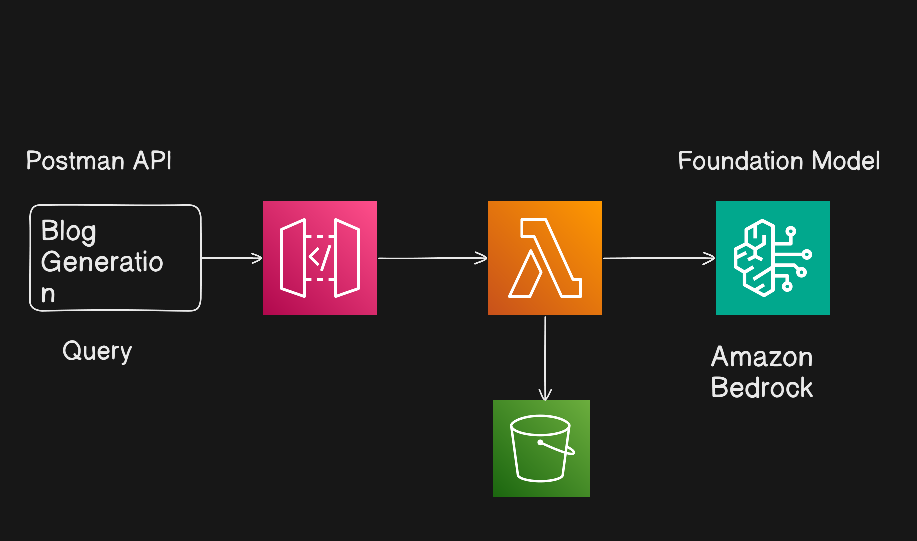

### End To End Generative AI Project On AWS Using AWS Bedrock And AWS Lambda

Architecture flow: API Gateway → Lambda → Bedrock & S3
- API Gateway: Entry point for requests
- Lambda: Orchestrates logic and connects services
- Bedrock: Generates blog content using foundation models
- S3: Stores the generated blogs securely and scalably
This setup showcases how AI + serverless can streamline content creation while keeping infrastructure lightweight, scalable, and cost-efficient.
